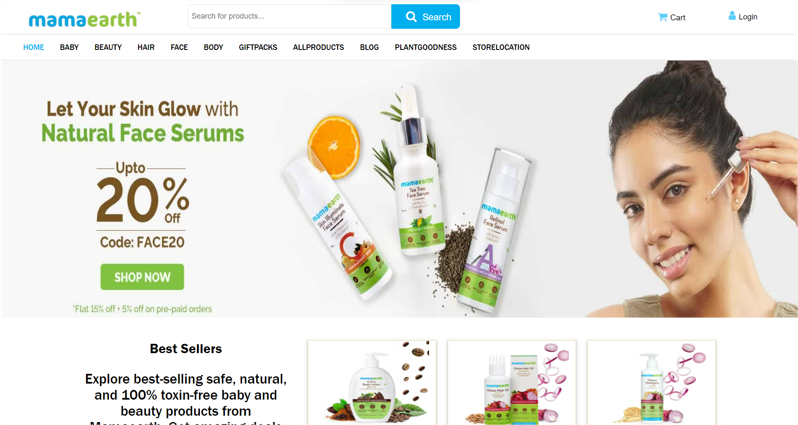

# Mama-Earth-Clone-Project

A website for buying various skincare products for babies and females.

Home.html is the landing page, where user can signin/login. 

Live view : <a href="https://eloquent-allen-ba4ad9.netlify.app/">Mama Earth</a>

A collaborative project built by a team of 3, executed in 5 days.

Features:
1. User Log in/Sign up
2. Sorting of products by price range
3. Product detail page.
4. Add to cart and dynamic cart features.
5. Payment section.

Tech Stack: HTML | CSS | Javascript | JSON

